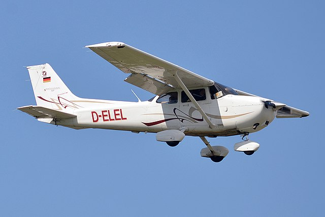
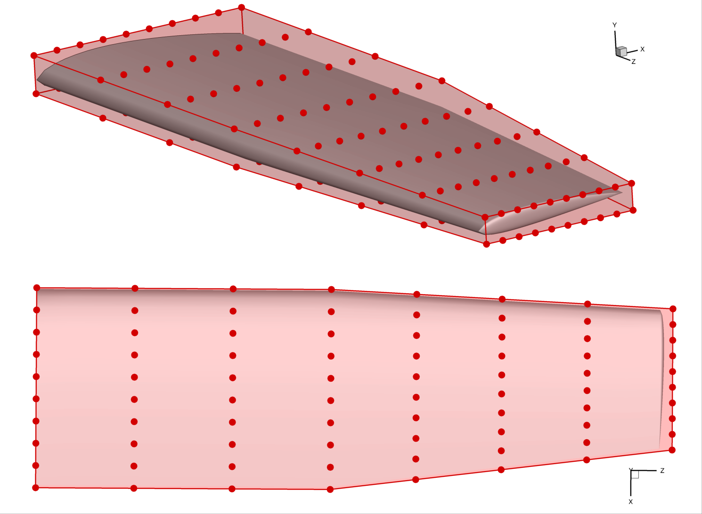
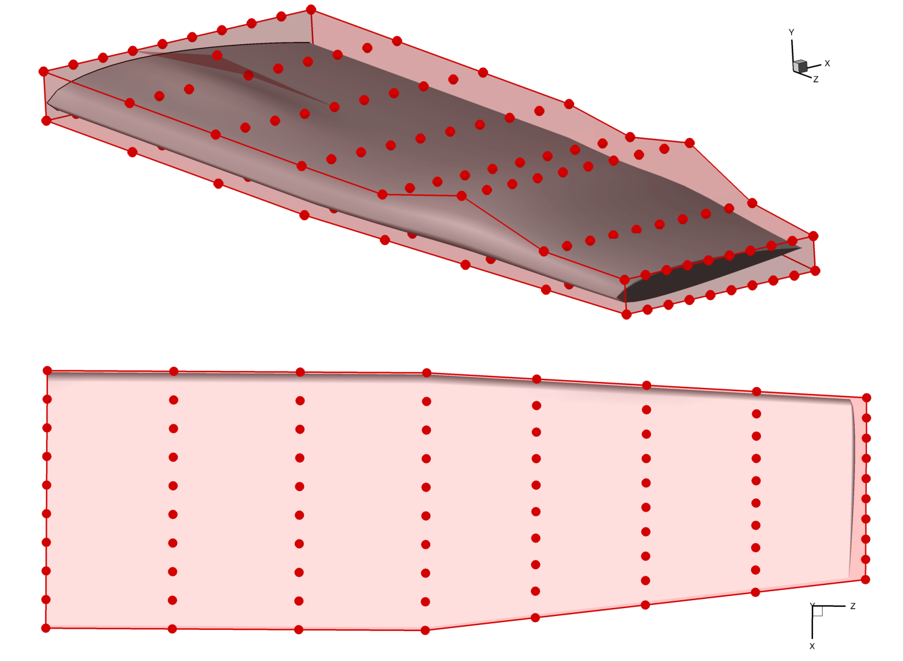
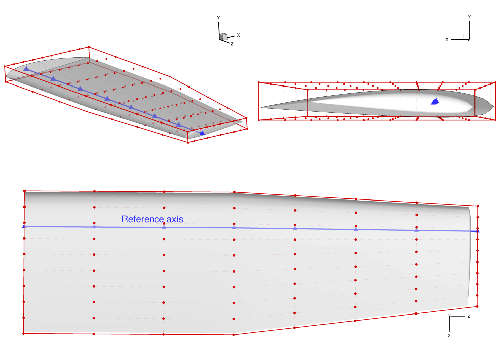
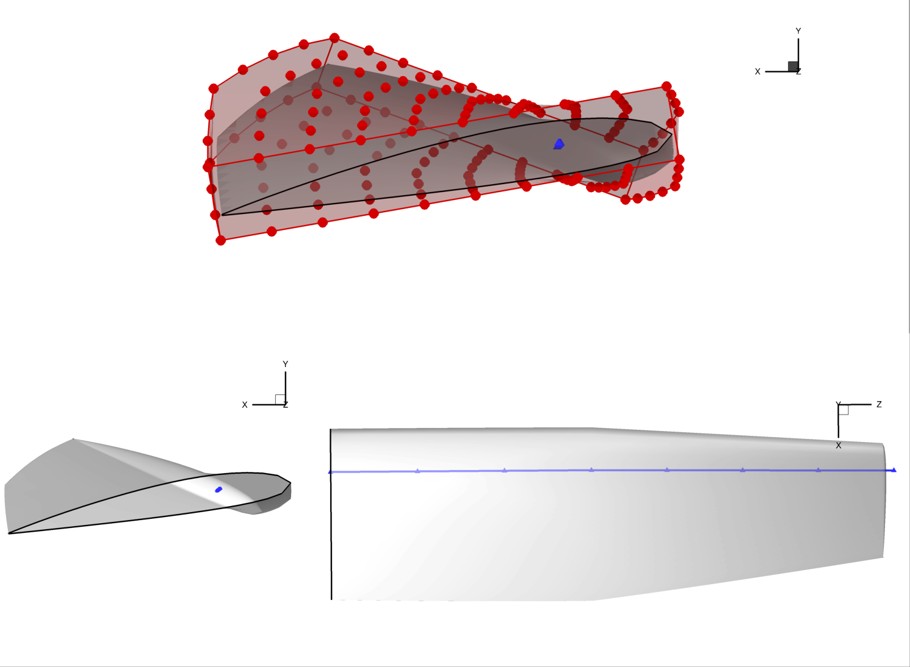
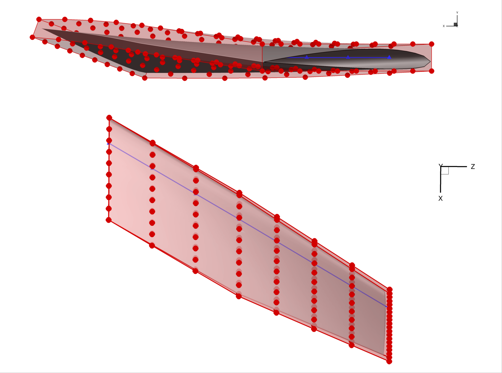
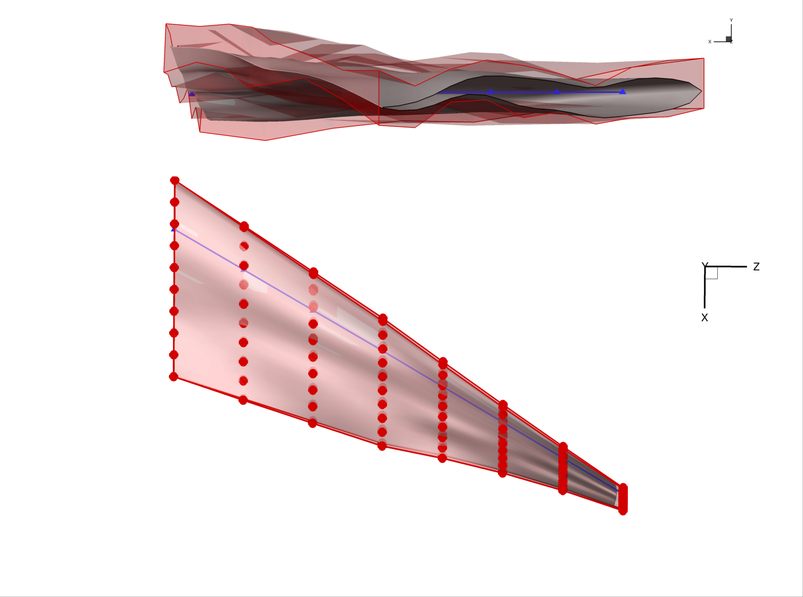

.. _advancedffd:

=======================================
Advanced FFD Geometry
=======================================

In the previous tutorial, we learned the basics of the free-form deformation (FFD) method of geometric parameterization.
However, we limited the parameterization to perturbing the individual control points.
In many applications, we will need to also allow for large-scale changes to the geometry, such as making an object longer, wider, or curved.

The purpose of this tutorial is to introduce *global* design variables in the :class:`.DVGeometry` FFD implementation.
During this tutorial, we will use the Cessna 172 airplane wing as our example geometry.

   A Cessna 172 in flight (Anna Zvereva, CC-BY)

-------------------------------------------
Generating baseline geometry and FFD volume
-------------------------------------------

We use the spline surfacing tool in `pyGeo` to generate the Cessna wing geometry from a list of airfoil sections and coordinates.
A full description of the surfacing script is beyond the scope of this tutorial, but the script itself can be found at ``examples/c172_wing/c172.py``.
Using the ``pyiges`` package, one of the IGES CAD files can be converted to a triangulated (.stl) format in order to turn the wing into a pointset.

Next, we need to create an FFD volume that encloses the wing. 
We want to approximate the wing closely without any of the wing intersecting the box.
Using our knowledge of the wing dimensions, it's easy to create a closely-conforming FFD.
The example script is located at ``examples/c172_wing/genFFD.py``.

The rendering below shows the FFD volume and the point set for the wing.
Note that the FFD control points are not constrained in the spanwise direction like they were in the cylinder example.
We can see that the FFD volume closely approximates the wing in the top view.

Starting in the tutorial script ``examples/c172_wing/c172.py``, we first create a :class:`.DVGeometry` object using the FFD file.
Then, we add the wing pointset.

.. literalinclude:: ../examples/c172_wing/runFFDExample.py
    :end-before: # rst add local DV

-----------------------------
Adding local design variables
-----------------------------

As in the "Getting Started" tutorial, we will first add local shape control by enabling perturbations of the individual control points in the thickness direction.
In the following example, we perturb a single point in the inner portion of the wing, and then the entire upper surface at an outboard station.

.. literalinclude:: ../examples/c172_wing/runFFDExample.py
    :start-after: # rst add local DV
    :end-before: # rst ref axis

This local perturbation produces the obvious deformation in the following rendering:

.. _global_vars:

-----------------------------------
Reference axes and global variables
-----------------------------------

Local control points are useful, but we often also want to see the effect of large-scale changes to the geometric design.
For example, we may want to twist a propeller blade, or lengthen a car's wheelbase.
To do this, we need to alter many local control points at once using a mathematical transformation.
We call this a *global design variable*.

Global design variables commonly include the following mathematical transformations:

- Rotation
- Linear stretching or shrinking
- Translation

Rotating a point requires knowing an axis of rotation. 
Scaling a point requires a reference point.
We can define these for the entire pointset by defining one or more *reference axes*.
A reference axis is defined as a line or curve within the FFD volume.

You can add a reference axis to your FFD volume by using the :meth:`.DVGeometry.addRefAxis` method.
There are two ways to define an axis.
The first is to define the axis explicitly by providing a :doc:`pySpline <pyspline:index>` curve (using the ``curve`` keyword argument).
This is the recommended approach for non-conventional FFD boxes (e.g. body-fitted sections).
The second (and more commonly-used) method is to specify the *direction* of the reference axis in terms of the FFD dimensions (i, j, or k), along with arguments (``xFraction``, ``yFraction``, ``zFraction``) that specify the relative location of the reference axis with respect to the maximum and minimum FFD coordinates at every spanwise section along the desired dimension x, y, or z.
Note that by default the reference axis node coordinates are defined using the mean of the sectional FFD points coordinates, and that the reference axis node cannot be moved outside the section plane.

The following excerpt illustrates how to create a reference axis for this Cessna 172 example.
The axis is named ``c4`` because it represents the quarter-chord line (the most useful reference point for aerodynamic analysis and design).

.. literalinclude:: ../examples/c172_wing/runFFDExample.py
    :start-after: # rst ref axis
    :end-before: # rst twist

The resulting reference axis is shown in blue in this rendering:

------------------------
Applying transformations
------------------------

Now that we have a reference axis, we can alter the geometry globally by either:

- applying transformations about the reference axis (scaling or rotation), or
- moving the control points of the reference axis (translation)

Let's start with applying a transformation, namely a twist to the wing.
We need to define a function that takes in a design variable value and performs a transformation along the reference axis.
The :class:`.DVGeometry` object has an attribute called ``rot_z`` which applies a rotation about the z-axis, and we can define a callback function to access it.
It is stored as a one-dimensional spline, and it has the same number of control points as the reference axis.
Indices of the ``rot_z`` control points correspond to the same location as the reference axis at that index.
Other transformations include ``rot_x``, ``rot_y``, ``scale_x``, and so on.
This only works "in plane", i.e. ``scale_`` cannot move the control section and any scaling operation perpendicular to its plane will be ineffective.

The two arguments to the callback are ``val`` (the design variable value, which can be a scalar or an array), and ``geo`` which is always an instance of :class:`.DVGeometry`.
Once we have a defined callback function, we can use the :meth:`.DVGeometry.addGlobalDV` method to create it as a design variable, as illustrated in the code snippet below.
The parameters ``lower``, ``upper``, and ``scale`` are used in the optimization process
(more detail can be found in the :doc:`MACH-Aero tutorial <mach-aero:index>` but is not necessary to understand this tutorial).
The optimizer can now apply a twist distribution to the wing.

.. literalinclude:: ../examples/c172_wing/runFFDExample.py
    :start-after: # rst twist
    :end-before: # rst sweep

The global design variable can be perturbed just like a local design variable, as illustrated in this snippet:

.. literalinclude:: ../examples/c172_wing/runFFDExample.py
    :start-after: # rst set DV
    :end-before: # rst set DV 2

Applying this twist results in the geometry pictured below. 
The location of the reference axis (and any points located close to the reference axis) is not affected by the rotation.
This is a general principle of applying transformations: *the reference axis location remains invariant under the transformation*.

-------------------------------
Manipulating the reference axis
-------------------------------

The second way to alter global geometry is by manipulating the reference axis itself.
Recall that the reference axis is a spline with a number of control points.
We can move these control points to produce global mesh motion just like perturbing local control points produces local motion.

We will demonstrate manipulating the reference axis by creating a sweep design variable.
First, we need to define a callback function that takes in the design variable values and manipulates the axis, as shown in the snippet below.
There are a few new methods to learn.
:meth:`.DVGeometry.extractCoef` gets the array of control point values (in order) from the ``c4`` reference axis.
To sweep the wing, we apply a rotation in the x-z axis about the innermost axis point.
The :meth:`.DVGeometry.restoreCoef` method sets the new axis position based on the manipulated points.

.. literalinclude:: ../examples/c172_wing/runFFDExample.py
    :start-after: # rst sweep
    :end-before: # rst set DV

.. note::
    There is a subtle implementation detail to know.
    Whenever the :meth:`.DVGeometry.setDesignVars` method is called, the reference axis is reset back to its original values.
    Therefore, there's no risk that perturbations in one optimizer iteration will stay around for the next.
    However, if multiple global DV callback functions manipulate the reference axis control points, only the first one will see "unperturbed" points.
    They will be called in the order that they are added.

Let's apply a 30 degree sweep as well as a linear 20 degree twist.
We can see how to do so in the snippet below.

.. literalinclude:: ../examples/c172_wing/runFFDExample.py
    :start-after: # rst set DV 2
    :end-before: # rst set DV 3

The results of the sweep are dramatic, as seen in the rendering.

This example illustrates an important detail; namely, that the local control points do not rotate in the x-z plane as the wing is swept back.
This is because of the way the reference axis is implemented.
Every local control point (the red dots) is *projected* onto the reference axis when the axis is created.
In this case, by default, the points were projected along the x axis. 
Once the points are projected, they become rigidly linked to the projected point on the axis.
Even if the reference axis is rotated, the rigid links do *not* rotate.
However, the links do translate along with their reference point.
Only the ``scale_`` and ``rot_`` operators change the rigid links.
:meth:`.DVGeometry.writeLinks` can be used to write out these links, which can then be viewed in Tecplot. 

--------------------------------
Multiple global design variables
--------------------------------

It is common to use several global design variables in addition to the local design variables.
For example, an aircraft problem might have global design variables for wing span, taper ratio, aspect ratio, dihedral, sweep, chord distribution, and more.
Each of these can be implemented through a combination of transformations and axis manipulation.

Let's say that we want to change the chord distribution of the wing in addition to the sweep.
We have to begin by writing a callback function, as follows:

.. literalinclude:: ../examples/c172_wing/runFFDExample.py
    :start-after: # rst set DV 3
    :end-before: # rst set DV 4

We implement the chord distribution using the ``scale_x`` transformation which stretches points about the reference axis in the x direction.
Now we need to create a global design variable and perturb the variable to produce the desired effect.
Let's also introduce a random perturbation to the local design variables to see the combined effect of sweep, twist, chord, and local deformation.

.. literalinclude:: ../examples/c172_wing/runFFDExample.py
    :start-after: # rst set DV 4

The combination of multiple global and local design variables produces the wild shape in the rendering below. 
Obviously this is not a suitable optimized aircraft design.
However, the optimizer is free to use all of these degrees of freedom to eventually find the best possible result.

The order of operations is important when multiple global variables are used.
By default, the order of operations is as follows.

There are two one-time setup steps at the beginning that happen "under the hood":

- A reference axis is created using :meth:`.DVGeometry.addRefAxis`.
- The pointsets *and* FFD control points are projected onto the axis. The projected point on the axis (in parametric coordinates) is forever linked to the corresponding pointset point or FFD control point.

During each call to :meth:`.DVGeometry.setDesignVars`:

- The reference axis control points retrieved with :meth:`.DVGeometry.extractCoef` are reset to the baseline values (**one time!** not after each callback)
- Callback functions are invoked in the order they are added using :meth:`.DVGeometry.addGlobalDV`. The results are saved but not yet *applied*.

Finally, during the :meth:`.DVGeometry.update` method:

- New reference axis projection points are computed based on the changes to the reference axis control points done by the callback functions.
- Rotations are applied to the pointsets and FFD control points using the reference axis projections as the pivot point.
- Depending on the choice of ``rotType`` when ``addRefAxis`` is invoked, the ``rot_x``, ``rot_y``, and ``rot_z`` transformations may be applied in arbitrary order. The default is z, x, y.
- ``scale_x``, ``scale_y``, and ``scale_z`` are applied based on the vector from each point to its reference axis projection. Points on the reference axis will not change at all under either rotation or scale.
- A separate ``scale`` parameter is applied which stretches all points isotropically based on their distance and direction from the reference axis projected point.
- Lastly, local FFD perturbations are applied. For :meth:`.DVGeometry.addLocalDV`, the perturbations are applied in the Cartesian frame. For :meth:`.DVGeometry.addLocalSectionDV` the perturbations are applied relative to the untwisted FFD section cuts.

-------
Summary
-------

The FFD method can seem complicated, especially when multiple global design variables are involved.
However, it is very general and has great performance, making it a good choice for general-purpose shape optimization problems.

In this tutorial, you learned how to set up global variables and make the most of FFD geometry.
You now know enough to fully understand and extend more complex, FFD-based, shape optimization problems, such as those covered in the :doc:`MACH-Aero tutorial <mach-aero:index>`.

The scripts excerpted for this tutorial are located at ``pygeo/examples/c172_wing/runFFDExample.py`` and ``genFFD.py``.
