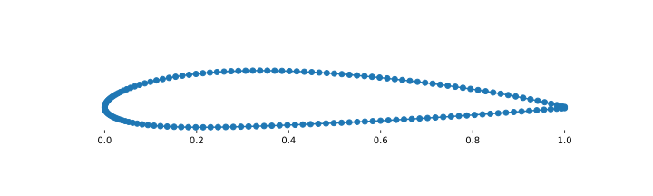
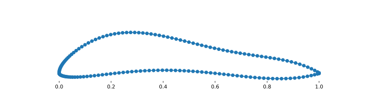
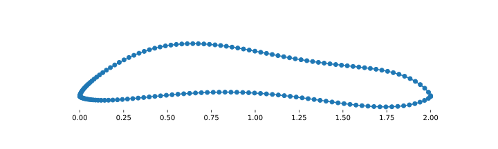

.. _csttutorial:

====================
CST Airfoil Geometry
====================

pyGeo includes a Class-Shape Transformation\ :footcite:p:`CST` (CST) implementation for airfoil parameterization called DVGeometryCST.
In addition to CST coefficients, it allows the user to add design variables for the chord length and class shape parameters.

Setting up a CST parameterization requires only an airfoil dat file, so initialization is straightforward.
After the DVGeometryCST object is initialized with the airfoil dat file, we add design variables.
Next, we add pointsets that will be deformed when the airfoil shape is updated.
Finally, we can change the variables to update the airfoil shape and associated pointsets.

Note that while the CST parameterization is easy to set up and use, it may not be the best choice for all applications.
As we increase the number of CST coefficients that parameterize the airfoil shape, the parameterization becomes poorly conditioned.
This may result in unexpected optimizer behavior, such as adjacent CST design variables ending up at very large equal and opposite values.

This parameterization makes the following assumptions:

- The initial airfoil dat file is ordered continuously around the airfoil and the beginning and end of the list is the trailing edge (no jumping around, but clockwise vs. counterclockwise does not matter)
- The pointset geometry is exclusively an extruded shape (no spanwise changes allowed)
- The airfoil's leading edge is on the left (minimum :math:`x`) and trailing edge is on the right (maximum :math:`x`)
- The airfoil is not rotated (trailing edge and leading edge are close to :math:`y = 0`)

--------------------------
Initializing DVGeometryCST
--------------------------

We begin by initializing the DVGeometryCST object.
We provide the dat file's name, which is used as the initial airfoil shape.
We also provide the number of CST coefficients that will be used to parameterize the upper and lower surfaces (in this case we use four for each surface).

.. literalinclude:: ../examples/cst/CSTTutorial.py
    :start-after: # rst Init (beg)
    :end-before: # rst Init (end)

The initialization analyzes the airfoil coordinate data to determine airfoil properties and fit the CST coordinates to the airfoil to provide a starting point.
It identifies the trailing edge to figure out whether it has a sharp or blunt trailing edge.
It then fits a spline to the upper and lower surfaces that is used to determine which points in a point set are on the upper surface and which are on the lower.
Finally, it computes the CST coefficients that achieve the best fit of the input airfoil (assuming the class shape parameters are 0.5 and 1.0).

DVGeometryCST assumes that the first index in each point coordinate (a.k.a the :math:`x` coordinate) is the chordwise coordinate and the second (a.k.a the :math:`y` coordinate) is the vertical.
If your geometry is oriented differently, the indices can be set here with the ``idxChord`` and ``idxVertical`` optional arguments.

------------------------
Setting design variables
------------------------

The next step is to tell the DVGeometryCST object which design variables to use.
When the ``addDV`` method is called, we pass the name of the design variable we'd like to use and the type. The available design variables types (not case sensitive) are

- ``"upper"``: upper surface CST coefficients (specify ``dvNum`` to define how many)
- ``"lower"``: lower surface CST coefficients (specify ``dvNum`` to define how many)
- ``"N1"``: first class shape parameter for both upper and lower surfaces (adds a single DV)
- ``"N2"``: second class shape parameter for both upper and lower surfaces (adds a single DV)
- ``"N1_upper"``: first class shape parameters for upper surface (adds a single DV)
- ``"N1_lower"``: first class shape parameters for lower surface (adds a single DV)
- ``"N2_upper"``: second class shape parameters for upper surface (adds a single DV)
- ``"N2_lower"``: second class shape parameters for lower surface (adds a single DV)
- ``"chord"``: chord length in whatever units the point set length is defined and scaled to keep the leading edge at the same position (adds a single DV)

Note that either the upper/lower surface class shape parameter DV can be defined (e.g., ``"N1_upper"``), or the DV for both the upper and lower surfaces' class shape parameter can be defined (e.g., ``"N1"``), but not both.

For this tutorial, we'll add upper and lower CST coefficients, the two class shape parameters applied to both the upper and lower surfaces, and the chord length.

.. literalinclude:: ../examples/cst/CSTTutorial.py
    :start-after: # rst DV (beg)
    :end-before: # rst DV (end)

We set lower and upper bounds on the CST coefficient design variables.
These are not used here, but would be passed to the optimizer in an optimization problem.
A design variable scaling can also be supplied.

----------------
Adding pointsets
----------------

Now it is time to pass in the pointsets that we want the DVGeometryCST object to manipulate.
In practice these would come from a CFD solver, so here we just use points from the airfoil dat file.

We begin by reading in the points from the dat file.

.. literalinclude:: ../examples/cst/CSTTutorial.py
    :start-after: # rst Create pointset (beg)
    :end-before: # rst Create pointset (end)

Pointsets are passed as a set of points in 3D space to maintain the same interface as the other pyGeo parameterizations.
However, this CST parameterization is only 2D, so the "z" coordinates are ignored.
Thus, we add a column of zeros for the z coordinates.

The DVGeometryCST object does not care about the order of the points in the pointset.
It will snap each point in the passed in pointset to whichever surface of the airfoil (upper or lower) is closest using the spline representation generated in the initialization.
The x coordinate of each point in the pointset is maintained and the y coordinate is moved to the value of the spline at the x coordinate.
To see the pointset coordinates and which surface they are being assigned to as they are passed in, set ``debug=True`` in the initialization step.

Take a look at the pointset the DVGeometryCST object now has:

-------------------------------
Perturbing the design variables
-------------------------------

To perturb the design variables, we call ``setDesignVars`` with the new design variables values and then call ``update``.
The ``setDesignVars`` method dates in a dictionary where the keys are the design variable names and the values are the new design variable values (as NumPy arrays).

Let's first change the upper and lower CST coefficients.

.. literalinclude:: ../examples/cst/CSTTutorial.py
    :start-after: # rst Perturb one (beg)
    :end-before: # rst Perturb one (end)

The airfoil shape has now changed to look like this:

Next, let's adjust the class shape parameters and the chord length.

.. literalinclude:: ../examples/cst/CSTTutorial.py
    :start-after: # rst Perturb two (beg)
    :end-before: # rst Perturb two (end)

The underlying airfoil class shape has now changed and note that the chord length has doubled.

-------
Summary
-------

In this tutorial, you learned how to use pyGeo's CST airfoil parameterization.
The details of the class's other methods can be found in the :ref:`API documentation <DVGeometryCST>`.
It includes tools for computing shapes from CST coefficients (and inversely, determining CST parameters by fitting coordinates).
It also has methods for analytically computing derivatives of the coordinates with respect to design variables.

.. footbibliography::
