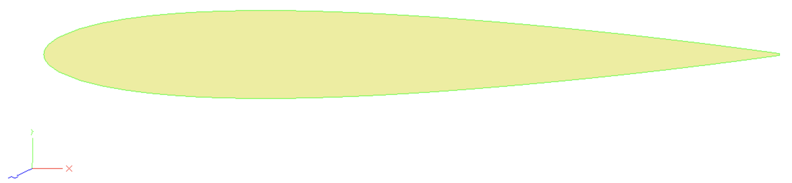
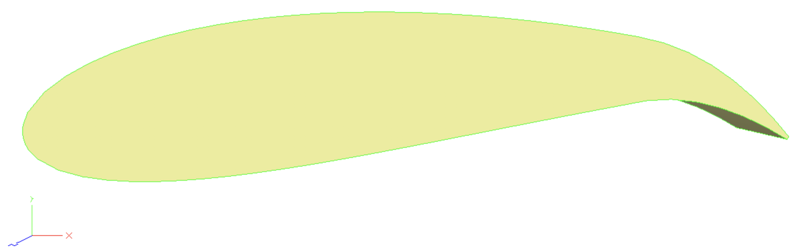

.. _esp_airfoil:

==================================
Geometry Parameterization with ESP
==================================

Previous tutorials discussed parameterizing geometry with pyGeo through FFDs.
pyGeo also supports parameterization with the `Engineering Sketch Pad (ESP) <https://acdl.mit.edu/ESP/>`_, an open-source CAD program.
This page is intended to build on the previously presented pyGeo information to show how ESP can be used instead of FFDs.
For information on how to install ESP and its dependencies for use in pyGeo, see the :ref:`installation page<install>`. 

The FFD approach is sometimes preferred because it is easy to set up and has a lot of freedom in how the design variables can change the geometry.
Unfortunately, the FFD control points are the only representations of the geometry other than the mesh, which can make it hard to take an optimized result and use it.
To avoid this, a CAD model can be used to parameterize the geometry instead of an FFD. 
This allows a single consistent format to represent the geometry throughout the optimization. 
The CAD model is used as an input, changed throughout the optimization, and then can be used as an output.  
This parameterization can take additional effort to set up but is sometimes preferred as it produces an output in a more traditional format useful in some applications. 

.. note:: 
    This tutorial is intended to only be a simple demonstration of how to use ESP with pyGeo. 
    For information about more complex modeling in ESP, please see their documentation and tutorials. 

------------------------
Generating the ESP model
------------------------

First, we will need to set up our ESP model with the parameterizations we will use later.
Then we can add the corresponding design variables in our runscript.

ESP models are created in a plain text scripting language.
The full script for this model can be found at ``pygeo/examples/esp_airfoil/naca0012.csm`` but we will show portions here.
For this basic example, we will create a simple airfoil model.

First, we create our design variables, which are called ``DESPMTR`` (design parameter) in the ESP model.
Our design variables will be camber (called ``camber_dv``), the location of max camber (``maxloc_dv``), and thickness (called ``thickness_dv`` in the script).

.. literalinclude:: ../examples/esp_airfoil/naca0012.csm
    :end-before: # rst initialize DV

Now we can use these design variables in another ESP feature, a ``UDPRIM`` or user-defined primitive.
The ``naca`` user-defined primitive will allow us to easily generate a NACA airfoil according to our design variables.
For more information on ``naca`` and other types of ``UDPRIM`` in ESP, see their documentation. 

.. literalinclude:: ../examples/esp_airfoil/naca0012.csm
    :start-after: # rst initialize DV
    :end-before: # rst airfoil 1

Because we need a 3D representation of an airfoil for most solvers, we will create another a second airfoil and use the ``BLEND`` command to create a shape between the two that does not change in the spanwise direction.

.. literalinclude:: ../examples/esp_airfoil/naca0012.csm
    :start-after: # rst airfoil 1
    :end-before: # rst airfoil 2

Opening the model in the ESP GUI, the side view of the airfoil should look as expected for a NACA 0012. 

--------------------------
Parameterizing using pyGeo
--------------------------

Now that we have an ESP model, we need to load it into pyGeo and define how our optimizer, through pyGeo, can change and deform the geometry.
First we need to initialize our ``DVGeo`` object like in the FFD case, but this time it is a :class:`.DVGeometryESP` object, the class specialized to manipulate ESP models.
Like our previous ``DVGeo`` objects were initialized with FFD files, this is initialized with the script that contains our ESP model. 

.. literalinclude:: ../examples/esp_airfoil/esp_airfoil.py
    :start-after: # rst create dvgeo start
    :end-before: # rst create dvgeo end

Just as in the :ref:`FFD approach <pointsets>`, a pointset is necessary for pyGeo to internally keep track of the geometry. 
We will again use an existing triangulated surface mesh to initialize the pointset.

.. literalinclude:: ../examples/esp_airfoil/esp_airfoil.py
    :start-after: # rst add pointset start
    :end-before: # rst add pointset end

Now we can add our design variables. 
These names must correspond with the names we chose for the design parameters in our ESP model. 
Here we will treat all three of our ESP design parameters as design variables in pyGeo, but we could have chosen a subset to add to our ``DVGeo`` object if we only wanted to modify camber and thickness for example.

.. literalinclude:: ../examples/esp_airfoil/esp_airfoil.py
    :start-after: # rst add DV start
    :end-before: # rst add DV end

.. note::
    When using pyGeo with FFDs there is a difference between :ref:`local <local_vars>` design variables and :ref:`global <global_vars>` design variables. 
    This distinction does not exist with using pyGeo with ESP models as the scope of each design variable is defined in the ESP model. 

---------------------------
Perturbing design variables
---------------------------

Now that our pointset, our ESP model, and our design variables are all tied together using pyGeo, we can perturb these design variables. 

The code snippet below illustrates a few key methods of the public API.
Note that these are similar to the :class:`.DVGeometry` methods used in the FFD case, with the addition of a method to write our new ESP model.

* :meth:`writeCSMFile <.DVGeometryESP.writeCSMFile>` writes a new ESP model with the updated design variable values.

.. literalinclude:: ../examples/esp_airfoil/esp_airfoil.py
    :start-after: # rst perturb DV start
    :end-before: # rst perturb DV end

Now we can see the new script for the ESP model at ``pygeo/examples/esp_airfoil/modified.csm``.
This can be loaded into the ESP GUI to see the effects of our changes to the design variables.

-------
Summary
-------

In this tutorial, you learned the basics of pyGeo's ESP geometry parameterization capabilities.
You now know enough to set up a basic shape optimization, such as the airfoil portion of the :doc:`MACH-Aero tutorial <mach-aero:index>`.

The scripts excerpted for this tutorial are located at ``pygeo/examples/esp_airfoil/esp_airfoil.py`` and ``naca0012.csm``.
