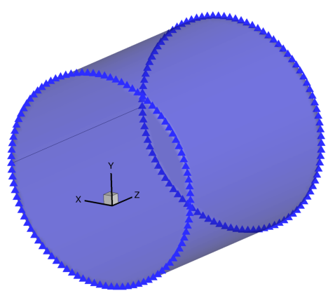
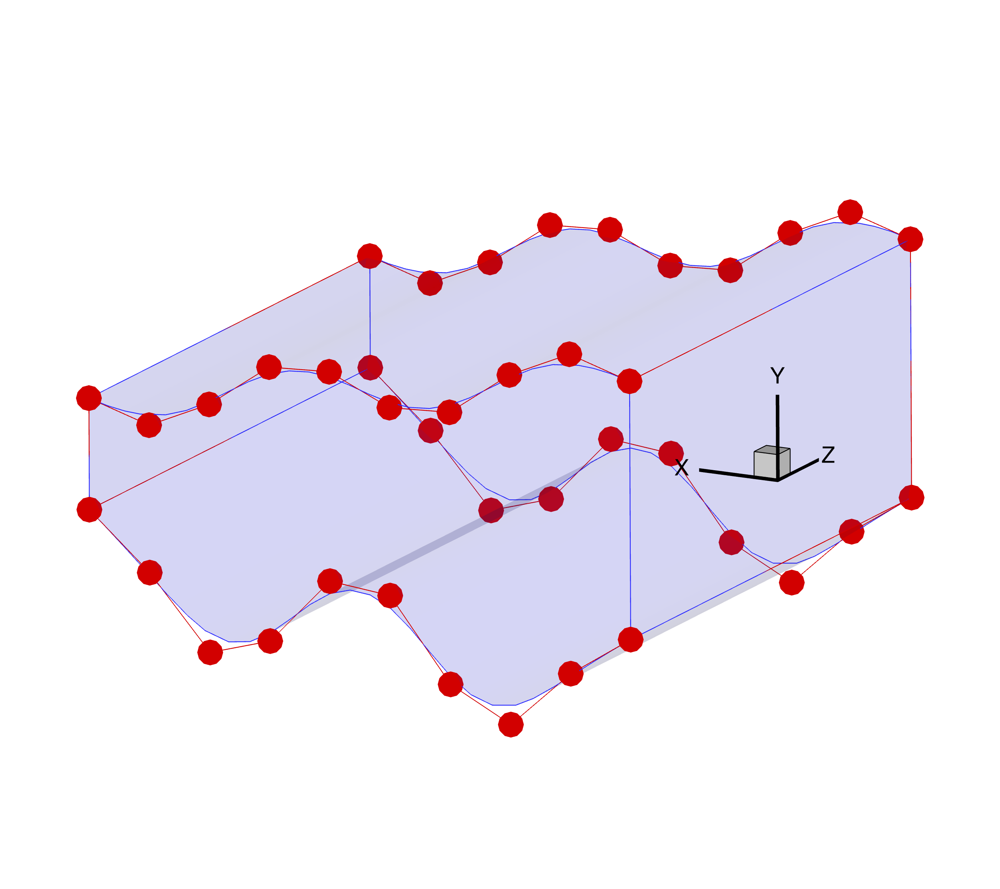

.. _gettingstarted:

===============
Getting Started
===============

This page is intended to introduce enough theory and practical advice for a user to set up a simple shape optimization using DVGeometry.

Let's say we want to do a structural shape optimization where we want to minimize the weight of a cylindrical pressure vessel.
First, we need to generate a pointset representing the cylinder.
Next, we'll need to set up a geometric parameterization.
Finally, we can perturb the geometry like an optimizer would and see the effect on the baseline cylinder shape.

----------------------------
Generating baseline geometry
----------------------------

.. _pointsets:

*Pointsets* are collections of three-dimensional points corresponding to some geometric object.
Pointsets may represent lines, curves, triangulated meshes, quadrilateral structured meshes, or any other geometric discretization.
The ``pyGeo`` package manages all geometric parameterization in terms of pointsets.
``pyGeo`` pointsets are always ``numpy`` arrays of dimension :math:`N_{\text{points}} \times 3`.

Shape optimization begins with a baseline geometry.
To keep things simple, we'll start with a cylinder centered on the point (0.5, 0.0, 0.0) extending 1.0 units along the z-axis, with a radius of 0.5.
The image below shows a simple pointset on the edge of the cylinder, along with a cylinder surface for reference.

This pointset was generated using the following code snippet:

.. literalinclude:: ../examples/ffd_cylinder/runFFDExample.py
    :end-before: # rst create DVGeo

----------------------
Creating an FFD volume
----------------------

We will use the free-form deformation (FFD) approach to parameterize the geometry by creating a :class:`.DVGeometry` object.

The FFD method details are fully described in `the paper <http://doi.org/10.2514/6.2010-9231>`_, but for now it suffices to understand FFD qualitatively.
First, the user creates an FFD *volume*, defined by a structured grid of *control points*.
FFD volumes can be of arbitrary shape, but they tend to be rectangular or prismatic in form.
They must completely enclose the pointsets to be added.
Next, a pointset is *embedded* in the FFD volume.
Finally, the control points defining the FFD volume can be moved in space.

As the control points move, they stretch and twist the FFD volume as if it were a block of jelly.
The points embedded in the volume move in a consistent way.
The image below shows the cylinder we made embedded in a cube-shaped FFD volume. 
The FFD control points are depicted with the large red dots and the embedding volume is the blue shaded region.

.. note::
    The FFD embedding volume is not necessarily coincident with the grid defined by the control points. 
    For example, they are coincident here (both are the region shaded in blue) but will diverge after the :ref:`deformation later <deform>`.
    The embedded volume and FFD control points can be viewed in Tecplot using the output from :meth:`writeTecplot <.DVGeometry.writeTecplot>`.

.. image:: ../examples/ffd_cylinder/images/cyl_embedded_undeformed.png
   :width: 450
   :align: center

``pyGeo`` expects the FFD volume to defined in the `Plot3D <https://www.grc.nasa.gov/www/wind/valid/plot3d.html>`_ file format.
Points must be defined in a complete, ordered 3D grid.
The structured grid axes are typically referred to as i, j, and k axes because they do not necessarily align with the x, y, and z spatial axes.
There must be at least 2 points in each dimension.

For 3D aerodynamic shape problems where the pointset is a surface, we usually leave one dimension of length 2 and it serves as the primary perturbation direction (e.g. up and down for an airfoil design problem).
The other two directions (generally streamwise and spanwise) should have more points.
Airfoil design problems may have just two points in the spanwise direction (as pictured here).

The following script creates the DVGeometry object and generates the pictured cube-shaped FFD volume.
Depending on the user's skill it may be possible to create FFD volumes which conform more closely to the pointset.
For a simple wing FFD, :meth:`createFittedWingFFD <pygeo.geo_utils.ffd_generation.createFittedWingFFD>` can be used to generate an FFD volume that is closely fitted to a given wing geometry.
All other things being equal, a fairly tight-fitting FFD volume is better, but there can be quite a bit of margin and optimization will still work.

.. literalinclude:: ../examples/ffd_cylinder/genFFD.py

Once we have an FFD volume file, we can finally create the actual :class:`.DVGeometry` object that will handle everything.

.. literalinclude:: ../examples/ffd_cylinder/runFFDExample.py
    :start-after: # rst create DVGeo
    :end-before: # rst add pointset

-----------------
Adding pointsets
-----------------

In order to retrieve parameterized pointsets later on, the baseline pointset must first be embedded in the FFD.
This is easily accomplished using the :meth:`addPointSet <.DVGeometry.addPointSet>` method.
Note that each pointset gets a name.
Pointsets (whether baseline or deformed) can be written out as a Tecplot file at any time using the :meth:`writePointSet <.DVGeometry.writePointSet>` method.

.. literalinclude:: ../examples/ffd_cylinder/runFFDExample.py
    :start-after: # rst add pointset
    :end-before: # rst add shape DV

.. _local_vars:

------------------------------------------
Parameterizing using local shape variables
------------------------------------------

Now that we have an FFD volume and a pointset, we need to define how we want the optimizer to change and deform the geometry.
We do this by adding design variables.
*Local* design variables allow for fine control of detailed features.

We can add a variable which allows for deforming the cylinder in the y-direction as follows:

.. literalinclude:: ../examples/ffd_cylinder/runFFDExample.py
    :start-after: # rst add shape DV
    :end-before: # rst getLocalIndex

Local design variables represent *perturbations* to the FFD control points in the specified direction, in absolute units.
For example, setting the array of local design variables to all zeros would produce the baseline FFD shape.
Setting one entry in the array to ``0.5`` would pull a single control point upward by 0.5 units, which stretches the pointset locally near that control point.

Generally, local design variables are defined in only one direction: the one requiring the finest local control.
Large-scale changes to the geometry in other axes can be handled well using global design variables, to be addressed later in :ref:`this section <global_vars>`.

It is important to understand a little about how the design variables are stored internally.
For implementation reasons, the raw array of control points is not in contiguous order.
If you need to access a particular control point, you can obtain its index in the design variable array by invoking the :meth:`getLocalIndex <.DVGeometry.getLocalIndex>` method, which returns a tensor of indices addressible in the same i, j, k layout as the FFD file you created.

The following example illustrates the use of the :meth:`getLocalIndex <.DVGeometry.getLocalIndex>` method in order to pull one slice of FFD control point coordinates (at k=0, a.k.a z=0) in contiguous order.
We can also print out the indices and coordinates of the FFD control points, which can be helpful for debugging. 

.. literalinclude:: ../examples/ffd_cylinder/runFFDExample.py
    :start-after: # rst getLocalIndex
    :end-before: # rst perturb geometry

---------------------------------
Perturbing local design variables
---------------------------------

Now that we have an FFD volume, an embedded pointset, and a set of design variables, we can perturb the geometry.
The following example perturbs the local design variables and illustrates how the cylinder deforms along with the control points.
You can now hopefully appreciate the physical analogy of the control points as pulling on a block of jelly.

The code snippet below illustrates a few key methods of the public API.

* :meth:`getValues <.DVGeometry.getValues>` returns the current design variable values as a dictionary where the keys are the DV names.
* :meth:`setDesignVars <.DVGeometry.setDesignVars>` sets the design variables to new values using an input dictionary.
* :meth:`update <.DVGeometry.update>` recalculates the pointset locations given potentially updated design variable values.

The updated pointset is returned from the method.
Pointsets can also be accessed as attributes of :class:`.DVGeometry` as required.

Note that we are using the :meth:`getLocalIndex <.DVGeometry.getLocalIndex>` method again to perturb the design variables symmetrically.
If we perturb a control point at :math:`k/z = 0`, we also perturb it by the same amount at :math:`k/z=1`.
Otherwise, the cylinder would become skewed front-to-back.
We are also using :meth:`getLocalIndex <.DVGeometry.getLocalIndex>` to perturb the top and bottom points differently, and in order.
Optimizers do not really care whether the points are in contiguous order, but as a human it is much easier to comprehend when addressed this way.

Also note that the dimension of the local design variable is :math:`N_{\text{points}}`, not :math:`N_{\text{points}} \times 3`.
This is because when we defined the design variable, we chose the y-axis only as the perturbation direction.

.. literalinclude:: ../examples/ffd_cylinder/runFFDExample.py
    :start-after: # rst perturb geometry
    :end-before: # rst plot

.. _deform:

We can now see the deformed state of the FFD control points and embedding volume. 
Now, unlike before, the FFD embedding volume (blue lines and shaded area) is not coincident with the grid defined by the FFD control points (red circles and lines).

We can also compare the locations of the original and deformed FFD control points as well as the resulting shapes. 

.. image:: ../examples/ffd_cylinder/images/deformed_cylinder.png
   :width: 600
   :align: center

-------
Summary
-------

In this tutorial, you learned the basics of ``pyGeo``'s FFD geometry parameterization capabilities.
You now know enough to set up a basic shape optimization, such as the :doc:`MACH-Aero tutorial <mach-aero:index>`.
More advanced topics include :ref:`global design variables <advancedffd>`, applying spatial constraints, and alternative parameterization options (such as :ref:`ESP <esp_airfoil>` or OpenVSP). 

.. TODO link to these once they're in 

The scripts excerpted for this tutorial are located at ``pygeo/examples/ffd_cylinder/runFFDExample.py`` and ``genFFD.py``.
