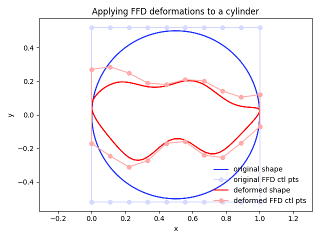

.. _gettingstarted:

===============
Getting Started
===============

This page is intended to introduce enough theory and practical advice for a user to set up a simple shape optimization using DVGeometry.

Let's say we want to do a structural shape optimization where we want to minimize the weight of a cylindrical pressure vessel.
First, we'll need to set up a geometric parameterization.
Next, we need to generate a point set representing the cylinder.
Finally, we can perturb the geometry like an optimizer would and see the effect on the baseline cylinder shape.

----------------------------
Generating baseline geometry
----------------------------

*Point sets* are collections of three-dimensional points corresponding to some geometric object.
Point sets may represent lines, curves, triangulated meshes, quadrilateral structured meshes, or really any geometric discretization.
The ``pyGeo`` package manages all geometric parameterization in terms of point sets.
``pyGeo`` point sets are always ``numpy`` arrays of dimension :math:`N_{\text{points}} \times 3`.

Shape optimization begins with a baseline geometry.
To keep things simple, we'll start with a cylinder centered on the point (0.5, 0.0, 0.0) extending 1.0 units along the z axis, with a radius of 0.5.
The image below shows a simple pointset on the edge of the cylinder, along with a cylinder surface for reference.

.. image:: ../examples/ffd_cylinder/images/cylinder_only_3d.png
   :width: 450
   :align: center

This pointset was generated using the following code snippet:

.. embed-code::
    ../examples/ffd_cylinder/runFFDExample.py:EXCERPT:1
    :layout: code

----------------------
Creating an FFD volume
----------------------

We'll use the free form deformation (FFD) approach to parameterize the geometry by creating a ``pygeo.DVGeometry`` object.

The FFD method details are fully described in `the paper <http://doi.org/10.2514/6.2010-9231>`_, but for now it suffices to understand FFD qualitatively.
First, the user creates an FFD *volume*, defined by a structured grid of *control points*.
The FFD volume can be of arbitrary shape, but they tend to be rectangular or prismatic in form, and they must completely enclose the point set geometries to be added.
Next, a point set is *embedded* in the FFD volume.
Finally, the control points defining the FFD volume can be moved in space.

As the control points move, they stretch and twist the FFD volume as if it was a block of Jello.
The points embedded in the volume will also strech and move in a consistent way.
The image below shows the cylinder we made embedded in a cube-shaped FFD volume. The FFD control points are depicted with the blue dots.

``pyGeo`` expects the FFD volume to defined in the Plot3D file format. 
Points must be defined in a complete, ordered 3D grid.
The structured grid axes are typically referred to as i, j, and k axes, since they do not necessarily align with the x, y, and z spatial axes.
Each dimension must be of length at least 2.

For 3D aerodynamic shape problems where the pointset is a surface, we usually leave one dimension of length 2 and it serves as the primary perturbation direction (e.g. up and down for an airfoil design problem).
The other two directions (generally streamwise and spanwise) should have more points.
Airfoil design problems may have just two points in the spanwise direction (as pictured here).

The following script creates the DVGeometry object and generates the pictured cube-shaped FFD volume.
Depending on the user's skill it may be possible to create FFD volumes which conform more closely to the pointset.
All other things being equal, a fairly tight-fitting FFD volume is better, but there can be quite a bit of margin and optimization will still work.

.. embed-code::
    ../examples/ffd_cylinder/genFFD.py
    :layout: code

Once we have an FFD volume file, we can finally create the actual ``DVGeometry`` object that will handle everything.

.. embed-code::
    ../examples/ffd_cylinder/runFFDExample.py:EXCERPT:2
    :layout: code

-----------------
Adding point sets
-----------------

In order to retrieve parameterized point sets later on, the baseline point set must first be embedded in the FFD.
This is easily accomplished using the ``DVGeometry.addPointSet`` method.
Note that each point set gets a name.
Point sets (whether baseline or deformed) can be written out as a Tecplot file at any time using the ``DVGeometry.writePointSet`` method.

.. embed-code::
    ../examples/ffd_cylinder/runFFDExample.py:EXCERPT:3
    :layout: code

------------------------------------------
Parameterizing using local shape variables
------------------------------------------

Now that we have an FFD volume and a point set, we need to define how we want the optimizer to change and deform the geometry.
We do this by adding design variables.
*Local* design variables allow for fine control of detailed features.

We can add a variable which allows for deforming the cylinder in the y direction as follows:

.. embed-code::
    ../examples/ffd_cylinder/runFFDExample.py:EXCERPT:4
    :layout: code

Local design variables represent *perturbations* to the FFD control points in the specified direction, in absolute units.
For example, setting the array of local design variables to all zeros would produce the baseline FFD shape.
Setting one entry in the array to ``0.5`` would pull a single control point upward by 0.5 units, which stretches the point set locally near that control point.

Generally, local design variables are defined in only one direction, the one requiring the finest local control.
Gross changes to the geometry in other axes can be handled well using global design variables, to be addressed later.

It's important to understand a little about how the design variables are stored internally.
For implementation reasons, the raw array of control points is not in contiguous order.
If you need to access a particular control point, you can obtain its index in the design variable array by invoking the ``DVGeometry.getLocalIndex`` method, which returns a tensor of indices addressible in the same i, j, k layout as the FFD file you created.

The following example illustrates the use of the ``getLocalIndex`` method in order to pull one slice of FFD control point coordinates (at k=0, a.k.a z=0) in contiguous order.

.. embed-code::
    ../examples/ffd_cylinder/runFFDExample.py:EXCERPT:5
    :layout: code

---------------------------------
Perturbing local design variables
---------------------------------

Now that we have an FFD volume, an embedded point set, and a set of design variables, we can perturb the geometry.
The following example perturbs the local design variables and illustrates how the cylinder deforms along with the control points.
You can now hopefully appreciate the physical analogy of the control points as pulling on a block of Jello.

The code snippet below illustrates a few key methods of the public API.
``DVGeometry.getValues`` returns the current design variable values as a dictionary where the keys are the DV names.
``DVGeometry.setDesignVars`` sets the design variables to new values using an input dictionary.
``DVGeometry.update`` recalculates the point set locations given potentially updated design variable values.
The updated point set is returned from the method, though point sets can also be accessed as attributes of ``DVGeometry`` as required.

Note that we're using the ``getLocalIndex`` method again to perturb the design variables symmetrically; that is, if we perturb a control point at k/z = 0, we also perturb it by the same amount at k/z=1.
Otherwise, the cylinder would become skewed front-to-back.
We're also using ``getLocalIndex`` to perturb the top and bottom points differently, and in order.
Optimizers don't really care whether the points are in contiguous order, but as a human it's much easier to comprehend when addressed this way.

Also note that the dimension of the local design variable is :math:`N_{\text{points}}`, not :math:`N_{\text{points}} \times 3`.
This is because when we defined the design variable, we chose the y axis only as the perturbation direction.

.. embed-code::
    ../examples/ffd_cylinder/runFFDExample.py:EXCERPT:6
    :layout: code

-------
Summary
-------

In this tutorial, you've learned the basics of ``pyGeo``'s FFD geometry parameterization capabilities.
You now know enough to set up a basic shape optimization, such as the `MACH-Aero tutorial <https://mdolab-mach-aero.readthedocs-hosted.com/en/latest/>`_.
More advanced topics include global design variables, applying spatial constraints, and alternative parameterization options (such as EngineeringSketchPad or OpenVSP).

The scripts excerpted for this tutorial are located at ``pygeo/examples/ffd_cylinder/runExample.py`` and ``genFFD.py``.