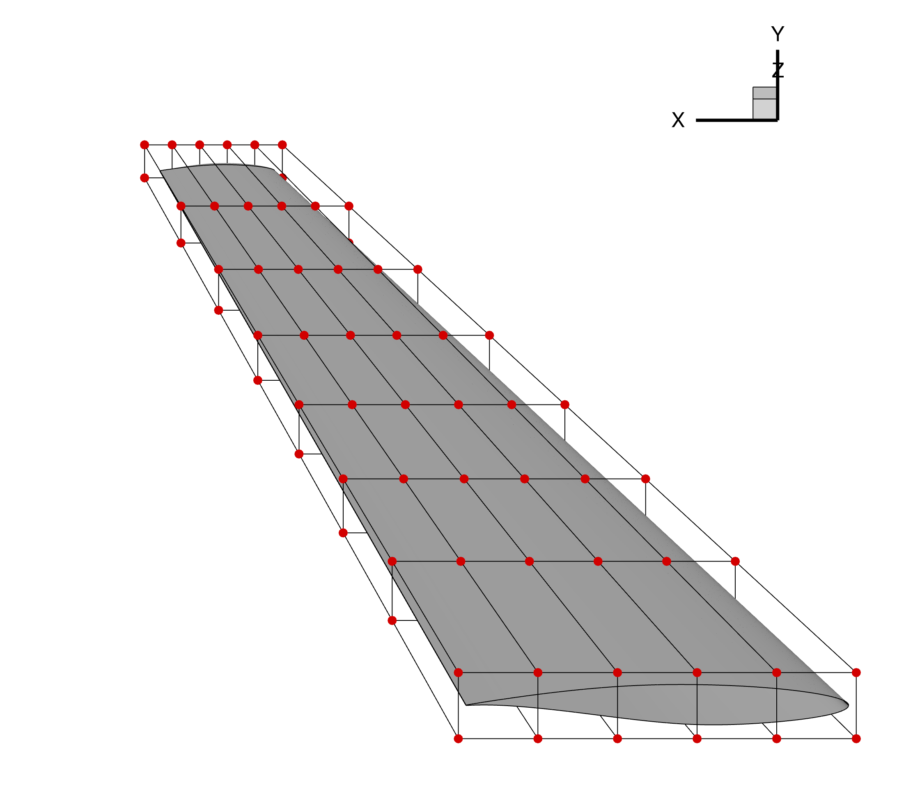
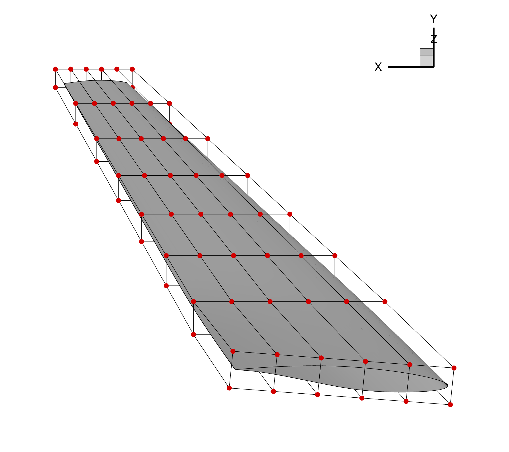

.. _update_pygeo:

****************************************
Updating pyGeo Geometry using DVGeometry
****************************************

Overview
========
After an optimization case has completed successfully, it is useful to extract the optimized geometry in a file format that is useable for Computer-Aided Design (CAD) software.
This can be done using pyGeo and deforming an object before writing it out in IGES file format.
This tutorial reviews the process of generating a pyGeo object that is deformed using an FFD in DVGeometry.
This functionality can be used to generate either an IGES file or Tecplot .plt file to be used after the optimization.

The geometry used for this example is the same as the one used in the :doc:`MACH-Aero tutorial <mach-aero:index>` and is shown below.

    Figure 1: Initial wing geometry and undeformed FFD grid

The run script and associated files for this example can be found under ``/examples/deform_geometry/`` folder within the pyGeo root directory.

Geometry Generation
===================
To update a pyGeo object using an FFD in a DVGeometry object, a pyGeo object must be loaded and passed to DVGeometry.
This can be done using any of the pyGeo input formats: lifting surface, IGES, or Plot3D.
Each of these options are used for this example in the runScript, as explained below.

Lifting Surface
---------------
The lifting surface type is generated as is done in the :doc:`MACH-Aero tutorial geometry generation <mach-aero:machAeroTutorials/aero_pygeo>`.
The airfoil sections are defined by text files and matched to spanwise sections, as defined by the ``x``, ``y``, and ``z`` coordinates.
The airfoil rotations and chords are defined for each section, and pyGeo is called with the provided parameters.

.. literalinclude:: ../examples/deform_geometry/runScript.py
    :start-after: # rst LiftingSurface
    :end-before: # rst LiftingSurface (end)

This pyGeo object is ready to be provided to DVGeometry to be deformed.

IGES
----
The geometry input into pyGeo can also come from an IGES file.
The IGES input file used for this tutorial is generated using the ``./geo/generate_wing.py`` script with the same proceedure used in the MACH-Aero tutorial and the lifting surface defined above.
The file can then be loaded into pyGeo using the following calls.

.. literalinclude:: ../examples/deform_geometry/runScript.py
    :start-after: # rst IGES
    :end-before: # rst IGES (end)

The call to ``geo.doConnectivity()`` is important as otherwise the IGES surfaces are treated as independent.
This function connects the surfaces and ensures that they move together.

.. note::
    While this feature may be compatible with a broad range of IGES files, it has only been tested with IGES files generated by pyGeo.
    Using an IGES file that is not generated by pyGeo may lead to unexpected behavior.

Plot3D
------
The geometry can also be loaded in Plot3D file format.
This format cannot easily be generated using pyGeo, so it requires using a separate tool such as ICEM.
For this example, the Plot3D file (with ``.xyz`` extension) is saved in the ``./geo/`` directory.

.. literalinclude:: ../examples/deform_geometry/runScript.py
    :start-after: # rst plot3d
    :end-before: # rst plot3d (end)

As with the IGES file, the calls to ``geo.doConnectivity()`` and ``geo.fitGlobal()`` are necessary to finalize importing the geometry and tie all of the components together.
If these functions are not run, the surfaces on the geometry may deform differently leaving gaps between patches.

.. warning::
    The output geometry file is highly dependent on the input geometry.
    If the input file is not sufficiently refined, the output geometry will not match the mesh used during the optimization.

    For example, when using a wing as in this example, it is best to specify several airfoil sections as opposed to one on the root and one on the tip.

DVGeometry Setup
================
To show how this feature works, we deform an FFD to twist the wing geometry.
The FFD file is generated the same way as the :doc:`MACH-Aero tutorial FFD generation <mach-aero:machAeroTutorials/opt_ffd>`.
Once the FFD is loaded into DVGeometry, we can add a reference axis about which we will deform the geometry.
Similarly, we can define the twist variable function, which will twist the wing about the reference axis.
For this case, we will twist the root of the wing five degrees by retrieving the dictionary of design variables, updating the appropriate twist variable, and resetting the design variable dictionary.

.. literalinclude:: ../examples/deform_geometry/runScript.py
    :start-after: # rst DVGeometry
    :end-before: # rst DVGeometry (end)

Update pyGeo Object
===================
Once the DVGeometry object is set up, we run our update function to deform our original geometry given the deformed FFD geometry.
This is done by calling the ``DVGeo.updatePyGeo()`` function, providing the pyGeo geometry object as the first parameter.
The second parameter specifies the output file type, which can be either ``"tecplot"`` or ``"iges"``, depending on the desired output format.
The final required parameter is the name of the output file, provided without an extension as an extension will be added matching the required output type.

.. literalinclude:: ../examples/deform_geometry/runScript.py
    :start-after: # rst UpdatePyGeo
    :end-before: # rst UpdatePyGeo (end)

Included in this function call are ``nRefU`` and ``nRefV``, which are refinement parameters.
The default values are 0, which represent no refinement of the input geometry object.
These refinement parameters add knot points on the B-spline surfaces to ensure that the deformation of the geometry more closely matches the deformed wing used during the optimization.
The refinement values can be provided as either integers, as is the case in this example, or as lists whose lengths match the number of surfaces in the geometry.
Increasing the refinement will help create a closer match between the generated fiile and the mesh used during the optimization but will increase the file size.

.. warning::
    Once the deformed geometry file is generated, check it against the deformed mesh from the optimization to ensure that they match.
    If there is a large difference between the two geometries, increase the refinement points and consider providing a more refined input file.

    Additionally, it is possible that refinement points are skipped if they conflict with points that already exist in the geometry file.
    In unique cases, you may find your output geometry may have fewer refinement points than expected.

Result
======
The deformed wing is show in the figure below, along with the FFD grid.
The IGES result can be loaded into CAD to visualize the deformed shape in IGES file format.

    Figure 1: Deformed wing geometry and FFD grid

As compared to the undeformed wing and FFD grid shown at the beginning of the tutorial, the root section of this airfoil is deformed given the prescribed FFD deformation.

Run it yourself!
================
This example can be run by calling ``runScript.py`` with the desired input file format, for example using the command::

    $ python runScript.py iges

The script will output a ``wingNew.plt`` file, which can be viewed in Tecplot.
To generate an IGES file, edit the calls to ``updatePyGeo()`` to request IGES instead of Tecplot.
