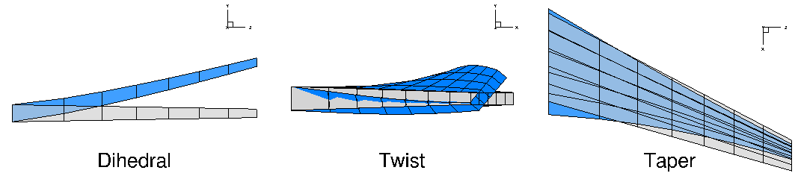

# Summary
In the field of aerodynamic shape optimization, the geometry of an object is often modified by an optimization algorithm in order to improve its performance.
A common example is the shape optimization of an aircraft wing, where the aerodynamic drag computed via computational fluid dynamics (CFD) and minimized by adjusting the external shape of the wing.
In a multidisciplinary design optimization context, aerodynamics and structural mechanics are considered and optimized simultaneously, which often provides additional benefit over optimizing only a single discipline.
In such cases, the geometry takes on an even greater significance in ensuring that multiple disciplines have a consistent and unified geometry representation.

pyGeo is a geometry package for aerodynamic and multidisciplinary design optimization.
It provides some basic geometry generation capabilities, several methods for geometry parameterization, numerous geometric constraints, and some utility functions for geometry manipulation.
The parameterizations and constraints are also differentiated to enable the use of gradient-based optimizers.

# Features
## Integrations

pyGeo was originally developed to use FFDs in MACH [@Kenway2010b].

pyGeo can be used as the basis for the geometry within the MDO framework MDO of Aircraft Configurations at High Fidelity (MACH) [@Kenway2014a], [@Kenway2014c].
Through MPhys, a wrapper for MACH, pyGeo's features can also be used within another MDO framework, OpenMDAO [@Gray2019a].

The package pyOptSparse [@Wu2020a] is used to interface with the optimizer directly. 
pyGeo's modules are used to send design variables and constraints to pyOptSparse rather than the user handling these interactions.

pyGeo has a solver-independent interface that allows for a direct comparison of two different solvers with the same parameterization [@Adler2022c]

## Geometry Generation
<!-- include sample wing picture -->
## Geometry Parameterization

pyGeo handles geometry manipulation through DVGeo objects. 
There are different types of DVGeo objects for different methods of geometry parameterization, but all use the same interface and create design variables which are passed to the rest of the framework for optimization. 

### Free-form Deformation
<!--
TODO:
- talk less about FFDs and more about capabilities
- child FFD
- multi FFD
- ref axis and complex geometric operations for a wing
- show pictures
-->
The free-form deformation (FFD) method [@Sederberg1986] is one of the most popular three-dimensional geometry parameterization approaches.
In this approach, the entire geometry is embedded in a flexible jelly-like block, and manipulated together with the control points of the block.
By introducing different densities of control points, a high degree of geometry control can be realized.

In general, the geometry is manipulated by moving the control points of the FFD volume.
However, in practice it is more common to define geometric operations involving a collection of FFD nodal movements.
For example, twist can be defined as rotations about a reference axis which runs along the wing.
\autoref{fig:FFD_DV} shows a few common planform design variables for an aircraft wing.
Parameterizations based on the singular value decomposition is also possible [@Wu2022b].

<!-- Compared to other parameterizations, the FFD method has several key advantages.
Since the entire geometry is embedded, there is no need to start with or reverse-engineer a parametric geometry representation as commonly done with B-spline-based methods, where a least-squares fit is needed to generate a B-spline surface representation.
Rather than parameterizing the geometry directly, the geometric _deformation_ is parameterized instead.
This decoupling of geometry definition from geometric deformation allows for control and refinement of the deformation independently of the original geometry.
When working with multiple geometries, for example an optimization involving an aerodynamic and structural surface simultaneously, both surfaces can be embedded into the same FFD volume.
As both surfaces would be manipulated by the same volume, coincident surfaces remain coincident after deformations and this approach ensures consistency between disparate geometries. -->

In addition to the basic FFD implementation, pyGeo offers two additional features: nested FFD volumes and multiple FFD volumes.

The basic FFD implementation lacks flexibility when the geometry has intersecting components.
In such cases, pyGeo can parameterize each component using FFDs and ensure a watertight surface representation at the component intersections using an inverse-distance surface deformation method [@Yildirim2021b].
This method relies on the open source pySurf package [@Secco2018b] to compute intersections between components, perform projections, and remesh curves.
\autoref{fig:ffd_multi} shows an example of a component-based FFD setup for a supersonic transport aircraft.

![Example of FFD parameterization with intersecting components [@Seraj2022a] \label{fig:ffd_multi}](ffd_multi.png)

### Parametric Geometry Tools

The flexibility and ease of setup of the FFD method make it preferable for some applications.
In other applications, however, it can be beneficial to have the geometry defined in a more commonly accepted engineering format, such as a computer-aided design (CAD) model or other parametric definition of the geometry.
CAD is the industry standard, so if manufacturing of a design is desired then a CAD model defining it is required. 

If the geometry is designed parametrically, the relationships between design variables and geometry is defined in the model itself.
In an FFD model of a box, for example, the FFD points could represent the four corners of the box, but then the user would be required to define the planes in which points move to change the length, width, and height of the box.
In a parametric modelling tool, the user would create a box by defining its initial length, width, and height.
For either case, the length, width, and height (or a subset) can be controlled in the optimization process as design variables.

#### Engineering Sketch Pad

Engineering Sketch Pad (ESP) [@Haimes2013a] is an open-source CAD software for creating parametric geometries. 
ESP can be used to create general CAD models for applications ranging from conceptual to detailed design.
These geometries can then be used in external analysis tools. 
pyGeo contains the module DVGeoESP which translates an ESP model into a form usable for the MACH framework and updates it with the changes throughout the optimization. 

#### OpenVSP

OpenVSP [@McDonald2022a] is a tool for creating 3D parametric geometries. 
Typically used for conceptual design, OpenVSP can be used to create geometries commonly used in aircraft vehicle applications. 
These geometries can then be used in external analysis tools. 
The DVGeoVSP module in pyGeo tranlates an OpenVSP model for use within the MACH framework and keeps it updated as the design variables are changed in the optimization. 

### Class Shape Transformation

The class shape transformation (CST) methodology [@Kulfan2008] is a popular airfoil parameterization.
It generates a shape by using Bernstein polynomials to scale a class function, which is most often a base airfoil shape. 
The class function is modified with two parameters, and the number of Bernstein polynomials is adjustable. 
pyGeo contains a module, DVGeoCST, that implements this airfoil parameterization. 
The implementation supports design variables for the Bernstein polynomial weightings, the class function parameters, and the airfoil chord length. 
It includes methods to analytically compute derivatives of the airfoil's surface coordinates with respect to the design variables, which is useful for gradient-based optimization. 
DVGeoCST can be used only for 2D problems, such as airfoil optimization. 

### Constraints

pyGeo also includes geometric constraints through the DVCon module. 
Constraints are all differentiated in order to use within gradient-based optimization. 
DVCon creates constraint objects which are passed to pyOptSparse. 

Some commonly used geometric constraints in shape optimization are thickness, area, and volume constraints. 
2D thickness constraints control the thicknesses between two surfaces in a plane. 
Area and volume constraints constrain the geometry from deviating from the initial design by some relative or absolute measure.

<!-- Triangulated surface constraint -->

# Parallelism
pyGeo can optionally work under distributed memory parallelism under MPI, which can be helpful when interfacing with CFD applications.
For example, the computational mesh may be partitioned and distributed among many processors, and each processor may be aware of only its portion of the mesh.
pyGeo can handle such scenarios seamlessly, by independently manipulating the geometry on each processor, and aggregating the constraints across all processors when communicating with the optimizer.

# Derivative Computation
In addition to geometry manipulation and constraints, pyGeo is able to compute derivatives of those operations.
For the geometric deformation, pyGeo can compute the Jacobian
\begin{equation*}
\frac{\mathrm{d}X_s}{\mathrm{d}x}
\end{equation*}
where $X_s$ is the vector of surface mesh coordinates, and $x$ the vector of geometric design variables.

Similarly for the constraints, the Jacobian
\begin{equation*}
\frac{\mathrm{d}g}{\mathrm{d}x}
\end{equation*}
can be computed, where $g$ is the vector of geometric constraints.

For the FFD parameterization, these derivatives are computed using a combination of analytic methods and the complex-step method [@Martins2003a].

# Statement of Need
Very few open-source packages exist with comparable functionalities.
To the best knowledge of the authors, the only other optimization framework that contains geometry parameterization is SU2 [@Economon2016a].
It supports Hicks--Henne bump functions for airfoil optimizations and the FFD method for three-dimensional cases.
However, it is integrated directly into the CFD solver SU2, and therefore cannot be used with other solvers.

It is worth noting here that both OpenVSP and ESP can be used directly in optimization without using pyGeo.
However, these direct uses have a few gaps in capabilities needed for high-fidelity MDO. 
pyGeo enables high-fidelity MDO with these tools through parallelism, efficient gradients, and geometric constraints, all while keeping the original tool in the optimization loop.
It provides an interface to OpenVSP and ESP that allows for their use with solvers beyond those which they are natively tied to. 

pyGeo has been used extensively in aerodynamic and aerostructural optimizations within aerospace engineering and related fields.
DVGeoESP made it possible to parameterize hydrogen tanks within a combined aerostructural and packing optimization [@Brelje2021a].
DVGeoVSP was used in the aeropropulsive optimization of a podded electric turbofan [@Yildirim2021c].
DVGeoCST was used to compare methods for airfoil optimization [@Adler2022c].
DVGeoMulti has been used to optimize a conventional aircraft [@Yildirim2021b], a T-shaped hydrofoil [@Liao2022], and a supersonic transport aircraft [@Seraj2022a].

# Acknowledgements

# References
